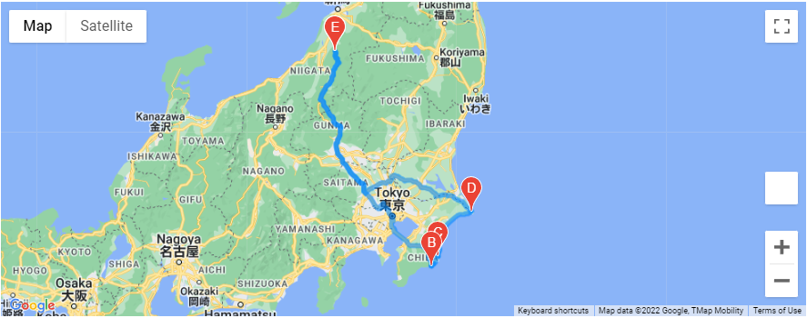
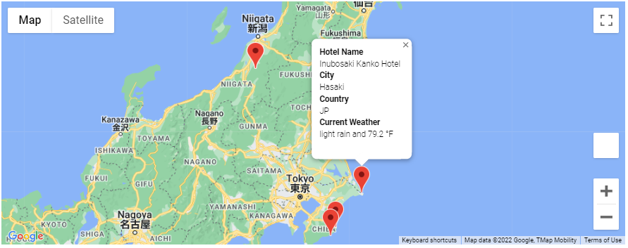

# PlanMyTrip Beta Changelog

## Overview of Project

The results of our beta test were stellar, however after user feedback, we are exploring the option to allow users choose their own vacation plan off parameters tehy want to set.

## Overview of the Results

We were successfully able to impliment our next set of revisions ready for testing. These features will aloow users to search by preferred temperature ranges. The resulting list will then ask users to choose 4 places they would like to vacation to that is within driving distance. (Air/boat travel is in progress). Once they users choose, we generate a driving route and best matched hotel for them to stay at in the cities of their choice.

## Results

We have internally tested the system with a planned vacation in Japan. Our system is in full swing and ready for more testers. 

The maps also list hotels and weather conditions of the city for our users to get real-time feedback of the city.

As we look to have more features added with the beta feedback, we want to have a second testing period ready.
